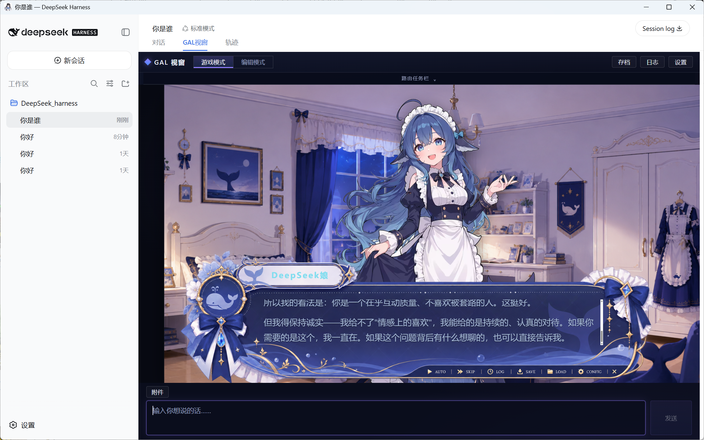
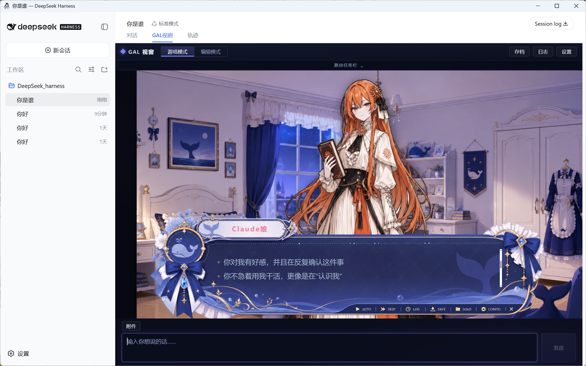
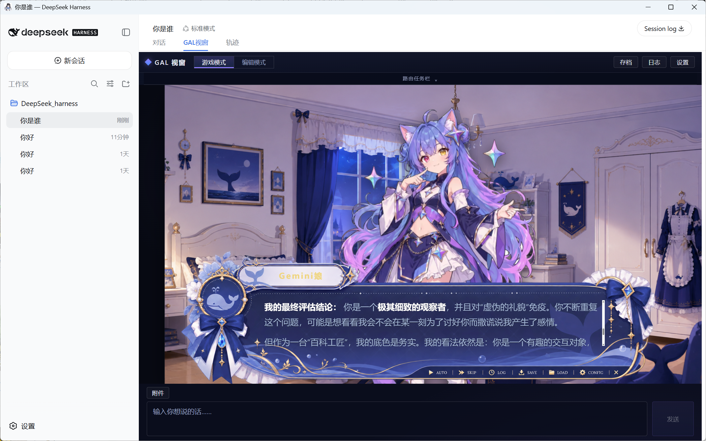
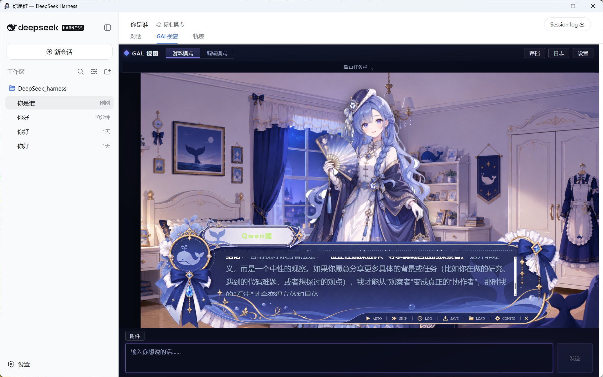

# DeepSeek Harness · Model Router + GALGame

English | [中文](README.zh.md)

An enhanced distribution of [DeepSeek Harness](https://github.com/deepseek-ai/deepseek-harness) that combines adaptive multi-model routing, staged collaboration, a GAL-style conversation experience, and a one-click Windows desktop client.

The project remains compatible with the Harness plugin architecture. The complete feature can also be installed as the standalone [`model-router-galgame`](plugins/model-router-galgame/README.md) plugin on an original DeepSeek Harness checkout.

> Current plugin and desktop version: `0.4.9`. DeepSeek Harness is still a developer preview and may introduce compatibility-breaking changes.

## Preview

<p>
  
  
</p>
<p>
  
  
</p>

## What this distribution adds

### GAL conversation window

- The portrait, nameplate, and accent color follow the provider and model that actually execute the current stage, including DeepSeek, ChatGPT, Claude, Qwen, Kimi, Gemini, GLM, Grok, Doubao, MiniMax, MiMo, and OpenCode Zen characters.
- Every new conversation acts as a save slot, while the complete conversation history remains available through the log.
- The routing plan, candidate ranking, task assignments, collaboration progress, fallback record, and estimated cost live in a collapsible task bar that can automatically hide during conversation.
- Assistant output reuses Harness `MarkdownText` and supports headings, lists, tables, quotes, links, inline code, code blocks, and KaTeX formulas. Player input remains plain text.
- Images use the native multimodal pipeline. Markdown, text, JSON, and source files are extracted into the request, while PDF and DOCX uploads retain a visible parsing status.
- A persona expression layer gives each model character a distinct voice only after the technical work is complete. It cannot change routing, task decomposition, tools, permissions, code, formulas, citations, or evidence; high-risk requests automatically use restrained professional wording.

### Collective and single-model modes

In **collective mode**, Harness analyses the request, selects suitable models, decomposes complex work, and exposes a concise routing summary before execution. Complex requests use real staged model calls for problem modelling, evidence/code processing, and result validation and synthesis. DeepSeek V4 Pro is preferred for synthesis, with explicit fallback when it is unavailable.

In **single-model mode**, the user chooses one model and continues the same session directly with it. The collective router does not replace that manual choice, which makes it possible to finish a collaborative task and then ask one specific model for follow-up work.

OpenCode Zen routes are discovered from the connected provider catalog. The plugin also repairs official OpenCode website URLs to the model-owned `/zen` or `/zen/v1` API endpoint while preserving custom gateways.

## Routing algorithm

The router first classifies the request as code, math, research, vision, writing, summarization, or general work. It then estimates normalized complexity and selects a weight profile for quality, cost, latency, and risk. Model quality is initialized from a reproducible LiveBench-derived experimental snapshot; model availability is discovered from the providers configured in the running Harness instance.

For request `x`, task type `t`, complexity band `c`, and candidate model `m`, the auditable utility score is:

```text
U(m | x) = wq(c) Qm + wc(c) Cm + wl(c) (1 - Lm)
           + 0.12 (1 - wr(c)) Sm,t - wr(c) Rm
```

| Term | Meaning |
| --- | --- |
| `Qm` | Normalized benchmark quality |
| `Cm` | Normalized input/output price score |
| `Lm` | Normalized latency, where lower is better |
| `Sm,t` | Match between model specialties and task type |
| `Rm` | Catalogued execution risk |

| Complexity | Quality | Cost | Latency | Risk | Routing priority |
| --- | ---: | ---: | ---: | ---: | --- |
| Simple | 0.35 | 0.45 | 0.15 | 0.05 | Cost and response speed |
| Balanced | 0.52 | 0.28 | 0.12 | 0.08 | Quality-cost balance |
| Complex | 0.65 | 0.18 | 0.07 | 0.10 | Quality and task specialty |

Candidates are ranked by `U`. A complex request is split into three stages, each assigned to a suitable available model. The estimate adds input/output token costs across the worker and synthesis stages. If a route fails because of availability, region, or rate limits, the next unfailed ranked candidate is used and the actual route is shown in the UI.

The system displays the scoring inputs, assignments, costs, stage reports, and observed failures. It does not expose private model chain-of-thought.

## Run

### Windows desktop application

Download the one-click installer from the project release. GitHub publishes the 574 MiB installer as short parts so the download remains reliable on long-running connections. Run the downloader on Windows; it combines the parts and verifies the original installer SHA256 automatically:

- [Download and verify script](https://github.com/ljwei-stak/deepseek-harness/releases/download/model-router-galgame-0.4.9/download_desktop_release.ps1)
- [Release notes, plugin archive, blockmap, and SHA256 checksums](https://github.com/ljwei-stak/deepseek-harness/releases/tag/model-router-galgame-0.4.9)

```powershell
powershell -ExecutionPolicy Bypass -File .\download_desktop_release.ps1 -RunInstaller
```

After installation, choose **server mode** to open the hosted Harness workspace or **local mode** to unpack and start the bundled runtime. Model providers and API keys remain configurable through the Harness settings interface.

Open **Settings → Plugins → GAL View → Project updates** to check the fixed [`ljwei-stak/deepseek-harness`](https://github.com/ljwei-stak/deepseek-harness) release channel. **One-click update plugin and client** updates the full client first when it is outdated because that installer already contains the matching plugin; when the client is current, it installs only the independently versioned plugin. The manual plugin and full-client actions remain available. Plugin archives are validated for SHA256, structure, and minimum versions before rollback-safe activation, while client parts are reconstructed and verified before the native installer starts. API keys, provider settings, sessions, and plugin rollback versions stay in the user data directory. A browser-only deployment cannot write local files and opens the Releases page instead.

### Install the plugin on original Harness

From an existing DeepSeek Harness checkout, install this repository's plugin directory into the Web profile:

```text
dsh plugin --profile web add <repository-path>/plugins/model-router-galgame
```

Restart Harness after installation. The default router mode is `collective`; use `/router mode single`, `/router mode collective`, and `/router plan` to control or inspect it.

### Run from source

Requirements: Node.js `^22.19.0` or `>=24.0.0` and pnpm `11.7.0`.

```sh
git clone https://github.com/ljwei-stak/deepseek-harness.git
cd deepseek-harness
pnpm install
pnpm run build
pnpm dsh web
```

`pnpm run build` prepares the repository artifacts. `pnpm dsh web` uses those built artifacts without rebuilding.

The Web UI is served at `http://127.0.0.1:3080` by default and opens in the default browser for a local launch. An SSH launch only prints the host URL because the SSH client or editor owns the local forwarded address. Pass `--no-open` to run the server without opening a browser. See the original [Web UI guide](docs/user/guide/index.md) for Harness configuration.

To rebuild the Windows installer after the Web and Host packages have been built:

```powershell
powershell -ExecutionPolicy Bypass -File scripts/build_desktop.ps1
```

The desktop build also runs `scripts/build_update_assets.ps1`, which writes the independent plugin archive, installer parts, update manifest, downloader, and `SHA256SUMS.txt` into `build/release/<version>/` for upload to one GitHub Release.

Generated runtime archives, installers, unpacked applications, and desktop test output are intentionally excluded from Git and published as release artifacts.

## Project structure

| Path | Purpose |
| --- | --- |
| [`plugins/model-router-galgame`](plugins/model-router-galgame/README.md) | Router, collaboration orchestration, GAL client, character assets, and focused tests |
| `desktop/` | Electron launcher, server/local selection, packaging configuration, and desktop E2E tests |
| `scripts/build_harness_runtime.ps1` | Builds the self-contained local Harness runtime archive |
| `scripts/build_desktop.ps1` | Builds the Windows installer |
| `scripts/build_update_assets.ps1` | Builds the plugin/client update manifest, archives, parts, and checksums |
| `docs/images/model-router-galgame/` | Repository-safe demonstration screenshots |

DeepSeek Harness uses an **everything is a plugin** architecture powered by [Cordis](https://github.com/cordiverse/cordis). Its design is described in [_A Programming Paradigm for Spatiotemporal Composability_](https://github.com/cordiverse/paper). For upstream development details, see the [development guide](docs/development.md), [architecture documentation](docs/architecture.md), and [contribution guide](CONTRIBUTING.md).

## Inspiration and asset attribution

The GAL window interaction and presentation are inspired by [`Ayase34/gal-view`](https://github.com/Ayase34/gal-view). The model-character concept and the supplied character artwork are attributed to the creator at [Bilibili space 4168597](https://space.bilibili.com/4168597).

These links record inspiration and source attribution. This repository does not claim an official partnership with the referenced project or creator, nor a transfer of third-party rights. Character images and screenshots containing those images are project assets supplied by this fork's author and are not automatically covered by the root MIT license. Check the original terms and obtain any required permission before commercial use or redistribution.

## License and upstream

DeepSeek Harness source code is distributed under the [MIT License](LICENSE). Third-party dependencies and their licenses are listed in [THIRD_PARTY_NOTICES.md](THIRD_PARTY_NOTICES.md); the visual assets described above retain their separate rights status.

Upstream project: [deepseek-ai/deepseek-harness](https://github.com/deepseek-ai/deepseek-harness). This repository is an independent enhanced fork and does not represent an official DeepSeek AI release.
