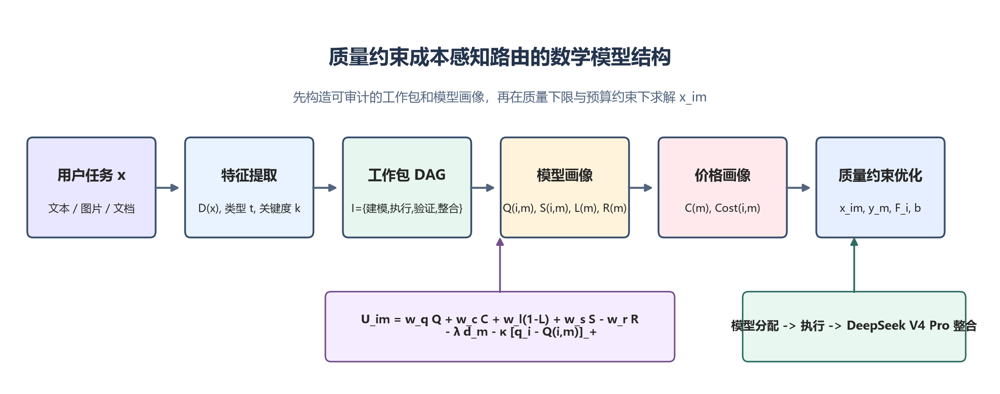
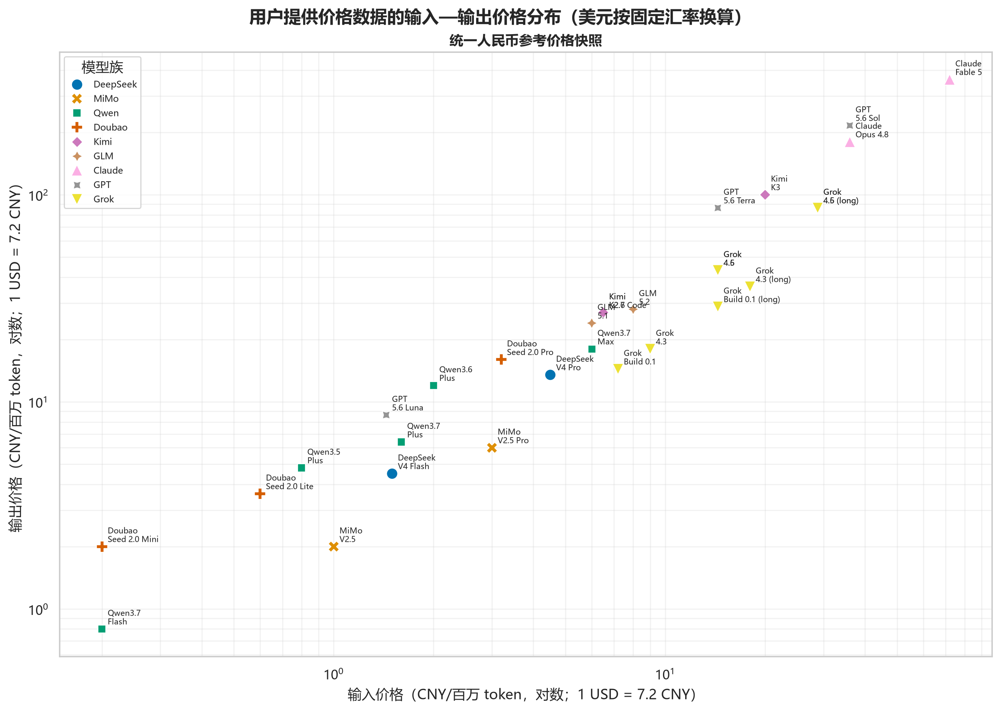
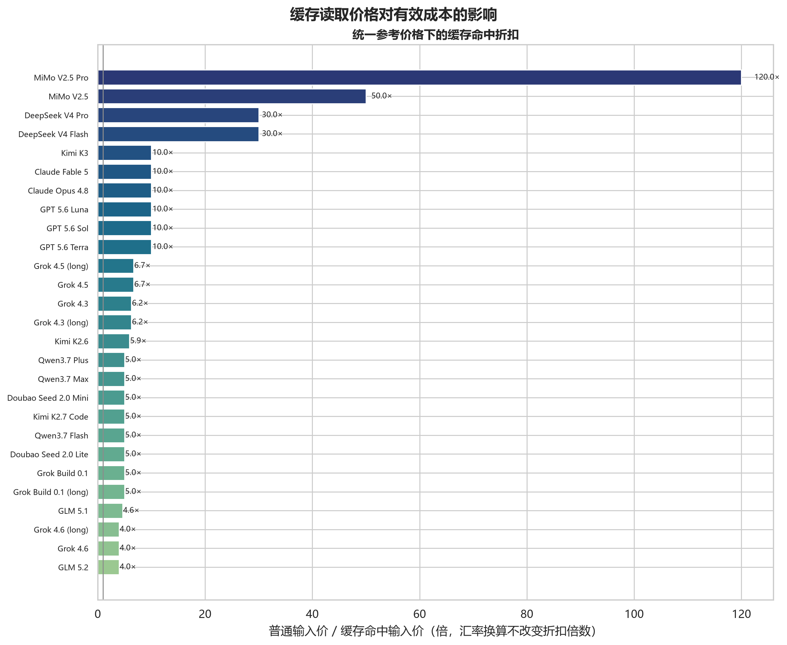

# Model Router 价格参考快照

本页记录用户于 2026-08-22 提供的价格截图，用于论文中的可复现实验和路由估价示例。截图中的部分数字是限时折扣、输入长度区间价格或中转站有效价；本页将它们标记为“截图有效价”，不把它们表述为供应商永久标准价，也不代表用户最终账单。

## 数据边界

- 价格单位为每百万 token；原始人民币和美元价格分开保存，绘图统一换算为人民币。
- 统一绘图使用固定实验汇率 `1 USD = 7.2 CNY`；该汇率只用于可比图表和示例费用，不代表实时结算汇率，修改脚本中的 `USD_TO_CNY` 即可重算。
- 输入、输出和缓存读取分别映射到 `p_in`、`p_out` 和 `p_cache_read`；截图未提供缓存写入价时，`p_cache_write` 留空，实验场景不虚构写入折扣。
- 同一模型存在多个上下文区间时，表中选择截图中较低输入区间的代表性价格，并在备注中保留区间；生产系统应根据实际 token 数选择分段价格。
- 估价默认按用户设置的缓存命中比例计算；没有缓存价的模型按普通输入价计算。实际 provider 返回的 usage 优先于估计值。
- 价格快照不包含 API Key、账户信息或请求内容；它只用于 `Cost(i,m)`、`C(m)` 和预算约束实验。

## 参考价格表

| 模型 | 模型族 | 币种 | 输入 | 输出 | 缓存读取 | 适用区间/备注 |
|---|---|---:|---:|---:|---:|---|
| DeepSeek V4 Flash | DeepSeek | CNY | 1.50 | 4.50 | 0.05 | 闲时、代表区间 |
| DeepSeek V4 Pro | DeepSeek | CNY | 4.50 | 13.50 | 0.15 | 闲时、代表区间 |
| MiMo V2.5 Pro | MiMo | CNY | 3.00 | 6.00 | 0.025 | 截图有效价 |
| MiMo V2.5 | MiMo | CNY | 1.00 | 2.00 | 0.020 | 截图有效价 |
| Qwen3.7 Plus | Qwen | CNY | 1.60 | 6.40 | 0.32 | 输入不超过 256K |
| Qwen3.7 Max | Qwen | CNY | 6.00 | 18.00 | 1.20 | 截图有效价 |
| Qwen3.7 Flash | Qwen | CNY | 0.20 | 0.80 | 0.04 | 0-32K |
| Qwen3.6 Plus | Qwen | CNY | 2.00 | 12.00 | — | 输入不超过 256K |
| Qwen3.5 Plus | Qwen | CNY | 0.80 | 4.80 | — | 0-128K |
| Doubao Seed 2.0 Pro | Doubao | CNY | 3.20 | 16.00 | — | 0-32K |
| Doubao Seed 2.0 Lite | Doubao | CNY | 0.60 | 3.60 | 0.12 | 0-32K |
| Doubao Seed 2.0 Mini | Doubao | CNY | 0.20 | 2.00 | 0.04 | 0-32K |
| Kimi K3 | Kimi | CNY | 20.00 | 100.00 | 2.00 | 截图有效价，1,048,576 上下文 |
| Kimi K2.7 Code | Kimi | CNY | 6.50 | 27.00 | 1.30 | 标准档，262,144 上下文 |
| Kimi K2.6 | Kimi | CNY | 6.50 | 27.00 | 1.10 | 标准档，262,144 上下文 |
| GLM 5.2 | GLM | CNY | 8.00 | 28.00 | 2.00 | 截图有效价 |
| GLM 5.1 | GLM | CNY | 6.00 | 24.00 | 1.30 | 低输入区间 |
| Claude Fable 5 | Claude | USD | 10.00 | 50.00 | 1.00 | 基础价；缓存写入另计 |
| Claude Opus 4.8 | Claude | USD | 5.00 | 25.00 | 0.50 | 基础价；缓存写入另计 |
| GPT 5.6 Sol | GPT | USD | 5.00 | 30.00 | 0.50 | 输入不超过 272K |
| GPT 5.6 Terra | GPT | USD | 2.00 | 12.00 | 0.20 | 输入不超过 272K |
| GPT 5.6 Luna | GPT | USD | 0.20 | 1.20 | 0.02 | 输入不超过 272K |
| Grok 4.6 | Grok | USD | 2.00 | 6.00 | 0.50 | 标准区间，500K context |
| Grok 4.6（长上下文） | Grok | USD | 4.00 | 12.00 | 1.00 | 长上下文 ≥200K，500K context |
| Grok Build 0.1 | Grok | USD | 1.00 | 2.00 | 0.20 | 标准区间，256K context |
| Grok Build 0.1（长上下文） | Grok | USD | 2.00 | 4.00 | 0.40 | 长上下文 ≥200K，256K context |
| Grok 4.5 | Grok | USD | 2.00 | 6.00 | 0.30 | 标准区间，500K context |
| Grok 4.5（长上下文） | Grok | USD | 4.00 | 12.00 | 0.60 | 长上下文 ≥200K，500K context |
| Grok 4.3 | Grok | USD | 1.25 | 2.50 | 0.20 | 标准区间，1M context |
| Grok 4.3（长上下文） | Grok | USD | 2.50 | 5.00 | 0.40 | 长上下文 ≥200K，1M context |

截图还包含 Doubao Seed 2.0 Code、Vision、Character、Translation、ASR 和 Kimi 高速版等区间。它们可通过设置页的 `provider/model` 覆盖录入；主实验先使用上表代表性文本模型，避免把不同计费单位混在同一组对比中。

## 映射到数学模型

对工作包 `i`，输入 token 数 `n_i^in`、输出 token 数 `n_i^out`，缓存读取比例 `rho_r` 和缓存写入比例 `rho_w` 由设置页给出：

```text
n_i^read  = floor(rho_r * n_i^in)
n_i^write = min(floor(rho_w * n_i^in), n_i^in - n_i^read)
n_i^bill  = n_i^in - n_i^read - n_i^write

Cost(i,m) = (n_i^bill p_in(m) + n_i^read p_cache_read(m)
             + n_i^write p_cache_write(m) + n_i^out p_out(m)) / 10^6
```

若截图没有缓存写入价，`rho_w` 应保持为 0；若没有可靠的缓存命中比例，`rho_r` 也保持为 0。这样做会略微保守，但不会因为“存在缓存单价”而虚构本次请求一定命中缓存。

## 参考实验场景

图表脚本使用统一场景 `100K` 输入、`10K` 输出和 `40%` 输入缓存命中率。对没有缓存读取价的模型，场景费用按 `100K` 普通输入计算；对有缓存读取价的模型，按 `60K` 普通输入加 `40K` 缓存读取计算。所有价格先按 `1 USD = 7.2 CNY` 换算，图中的人民币数值是估计费用，不是账单。







图表由 [`generate_model_router_figures.py`](../scripts/generate_model_router_figures.py) 生成，可在更新价格快照后重复运行。图表和表格应与论文中的 LiveBench 快照时间、汇率假设和实际账单校准结果一起报告。
